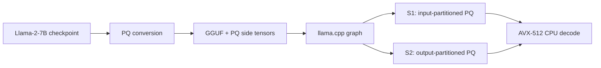

<div align="center">

<h1>EdgePQ</h1>

<p><strong>CPU-native two-bit product-quantized LLM decoding for many-core x86.</strong></p>

[](LICENSE)


[](https://huggingface.co/ZongwuWang/EdgePQ-4c8b)

EdgePQ co-designs product quantization and SIMD lookup-table execution to run
Llama-2-7B decoding directly on commodity CPUs, with no GPU in the decoding
critical path.

[Why EdgePQ](#why-edgepq) · [Results](#main-results) · [Quick Start](#quick-start) · [Reproduction](#reproduce-the-paper) · [Demo](#demo)

</div>

## Why EdgePQ

- **Two-bit CPU-native decoding.** Learned non-uniform codebooks reduce the
  weight stream while keeping the token-generation path on the CPU.
- **Dual-mode PQ GEMV.** Input-partitioned S1 and output-partitioned S2 layouts
  target different matrix shapes and are selected per layer.
- **Reproducible artifact.** A locked `uv` environment and Make targets cover
  input preparation, correctness checks, throughput, perplexity, and plots.



## Main Results

The paper reports the following results with 60 CPU threads:

| Model | TG128 (tok/s) | TG512 (tok/s) | WikiText-2 PPL |
|---|---:|---:|---:|
| F16 | 18.80 ± 0.79 | 20.55 ± 0.34 | 6.12 |
| Q2_K | 48.07 ± 1.35 | 47.80 ± 0.79 | 7.74 |
| **EdgePQ** | **55.35 ± 0.64** | **50.73 ± 1.87** | **6.33** |

The EdgePQ PPL value is measured by reconstructing the trained PQ checkpoint
into an FP16 Transformers model and evaluating complete, non-overlapping
4096-token WikiText-2 windows. Throughput uses the PQ side tensors embedded in
`base-pq-4c8b.gguf`.

> [!IMPORTANT]
> The table contains the paper-reported reference values. A reproduction run
> writes its measured values to `output/throughput.csv` and
> `output/perplexity.csv`; those CSV files are the source of truth for that run.

## Demo

The ten-minute walkthrough covers a fresh clone, environment and input setup,
correctness checks, the full evaluation, and result inspection. The recording
plan is available in [`video_demo/`](video_demo/).

> [!NOTE]
> The final `demo.mp4` has not been added yet. After it is uploaded through
> GitHub, place the generated GitHub asset URL on its own line here to enable
> inline playback in the README. Keep `video_demo/demo.mp4` as the downloadable
> artifact copy.

## Quick Start

```bash
git clone https://github.com/ZongwuWang/ESSC26_llama_pq.git
cd ESSC26_llama_pq

make env
make prepare-inputs
make check-inputs
make selftest
make smoke
```

For the complete measurement and plot pipeline:

```bash
make all
make plot
```

> [!TIP]
> `make all` runs the measurements and produces CSV files. `make plot` is a
> separate step that renders the two PNG charts.

## Requirements

| Workflow | Requirements |
|---|---|
| CPU decode, self-test, and throughput | Linux x86-64; AVX-512 FP16, VBMI, and VNNI; GCC/G++; CMake; Ninja; `uv`; 64 GB RAM or more |
| Full PPL reproduction | All CPU requirements plus an NVIDIA GPU with at least 32 GB memory and a compatible CUDA toolkit |
| Complete artifact download | About 60 GB free disk space |

The optimized decoding path itself does not require a GPU. The default build
uses `GGML_CUDA=ON` because the complete PPL workflow uses CUDA. For a CPU-only
build and decode smoke test, use:

```bash
make llama-build GGML_CUDA=OFF
make selftest GGML_CUDA=OFF
make smoke GGML_CUDA=OFF
```

Do not run `make ppl` or `make pq-ppl` in the CPU-only workflow.

## Prepare Inputs

The public model repository
[`ZongwuWang/EdgePQ-4c8b`](https://huggingface.co/ZongwuWang/EdgePQ-4c8b)
contains:

- `base-pq-4c8b.gguf`, which carries the deployable EdgePQ side tensors (the
  paper's FP16 baseline remains the separate `Llama-2-7b-chat-hf-f16.gguf`);
- `Llama-2-7b-chat-hf.Q2_K.gguf`, the exact Q2_K baseline used in the paper;
- `best-formal-hard/non_pq_state.pt`;
- all 224 files under `best-formal-hard/pq_states/`;
- `tokenizer.json`, `tokenizer.model`, and `tokenizer_config.json`.

The prepared inputs are loaded directly: `Llama-2-7b-chat-hf-f16.gguf` for F16,
`Llama-2-7b-chat-hf.Q2_K.gguf` for Q2_K, and `base-pq-4c8b.gguf` for EdgePQ.
The artifact does not rename or regenerate these files.

```bash
make env
make prepare-inputs
```

This downloads the EdgePQ GGUF, Q2_K baseline, checkpoint, and tokenizer from
[`ZongwuWang/EdgePQ-4c8b`](https://huggingface.co/ZongwuWang/EdgePQ-4c8b),
the F16 GGUF from
[`second-state/Llama-2-7B-Chat-GGUF`](https://huggingface.co/second-state/Llama-2-7B-Chat-GGUF),
and WikiText-2 directly from Hugging Face.

Default paths:

```text
models/base-pq-4c8b.gguf
models/Llama-2-7b-chat-hf-f16.gguf
models/Llama-2-7b-chat-hf.Q2_K.gguf
models/best-formal-hard/
models/tokenizer/
datasets/wikitext-2-raw-v1/
```

<details>
<summary><strong>Use custom input paths</strong></summary>

All input paths and runtime choices are Make variables:

```bash
make all \
  PQ_MODEL=/data/base-pq-4c8b.gguf \
  FP16_MODEL=/data/Llama-2-7b-chat-hf-f16.gguf \
  Q2_MODEL=/data/Llama-2-7b-chat-hf.Q2_K.gguf \
  PQ_CHECKPOINT=/data/best-formal-hard \
  PPL_DATASET=/data/wikitext-2-raw-v1 \
  TOKENIZER=/data/llama2-tokenizer \
  CUDA_DEVICE=0
```

</details>

## Build and Validate

```bash
make env
make llama-build
make check-inputs
make selftest
make smoke
```

The build includes `llama-perplexity`, `llama-quantize`, `pq-selftest`, and
`llama-pq-convert`. The root `llama_pq` benchmark runner is built when a target
needs it. `make smoke` generates eight tokens for each of the three models with
one measured repetition and does not retain a result file.

## Reproduce the Paper

Run the complete evaluation and then render the results:

```bash
make all
make plot
```

Individual stages are also available:

| Command | Purpose | Main output |
|---|---|---|
| `make selftest` | Compare registered PQ execution with the reference path | Terminal PASS/failure |
| `make benchmark` | Measure F16, Q2_K, and EdgePQ decode throughput | `output/throughput.csv` |
| `make ppl` | Evaluate F16 and Q2_K perplexity | `output/perplexity.csv` |
| `make pq-ppl` | Evaluate reconstructed EdgePQ perplexity | Appends to `output/perplexity.csv` |
| `make plot` | Render both result CSVs | Two PNG charts |

The complete PPL evaluation can take one to three hours. The default Make
variables match the paper protocol: F16/Q2_K use context 3072 and stride 2048;
PQ reconstruction uses context and stride 4096. These defaults can be
overridden when running controlled experiments.

## Output Files

| File | Contents |
|---|---|
| `output/throughput.csv` | Per-model TG128/TG512 throughput measurements |
| `output/perplexity.csv` | F16, Q2_K, and EdgePQ perplexity measurements |
| `output/throughput.png` | Throughput chart generated by `make plot` |
| `output/ppl.png` | Perplexity chart generated by `make plot` |

No persistent run logs are generated. Command output is printed to the
terminal, and a failed stage returns a non-zero exit status.

<details>
<summary><strong>Repository layout</strong></summary>

```text
ESSC26_llama_pq/
|-- pyproject.toml        # uv environment specification
|-- uv.lock               # locked Python dependencies
|-- Makefile              # artifact commands and defaults
|-- llama_pq.cpp          # F16 vs Q2_K vs EdgePQ throughput
|-- ppl_gguf_compare.py   # dataset preparation and PPL evaluation
|-- plot_results.py       # throughput and PPL charts
|-- llama.cpp/            # vendored, PQ-extended llama.cpp
|   |-- tools/pq-convert/ # checkpoint exporter
|   `-- tools/pq-selftest/# correctness self-test
|-- video_demo/           # recording plan and final walkthrough
`-- output/               # generated CSVs and charts, not tracked
```

</details>

## Clean Up

Remove only the root benchmark runner:

```bash
make clean
```

Remove the build, virtual environment, and generated outputs:

```bash
make distclean
```

Model and dataset inputs are never removed by these targets.

## Acknowledgements

- [llama.cpp](https://github.com/ggml-org/llama.cpp)
- [T-MAC](https://github.com/microsoft/T-MAC)
- The product-quantization work cited in the accompanying paper

## License

This repository is released under the terms in [`LICENSE`](LICENSE). The
Llama-2 model and derived artifacts remain subject to their applicable
licenses.
